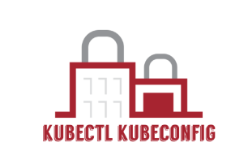

<div align='center'>

</div>

# `kubectl-kubeconfig` Plugin

A **kubectl plugin** that generates token-based kubeconfig files for your Kubernetes clusters.

When configure Kubectl uisng the cloud

## Use-Cases

```
✅ Grant Kubernetes cluster access without cloud provider auth helper
✅ Use Servce-Accounts tokens to provide access to a Kubernetes cluster
✅ Automagically add clusters that are
```

## Installation

```
curl -s https://kubeconfig.jovianx.app/install | bash
```

## Usage

Please see full list of available options by running:

```
kubectl kubeconfig generate --help
```

### Generate an administrative Kubeconfig

To create Kubernetes configuration file run following command:

```
kubectl kubeconfig generate
```

You should see description of changes going to be made. To confirm further execution press `y` to cancel press `n`.

```
'jovianx-admin' Kubernetes service account with *CLUSTER-ADMIN* role in 'jovianx-system' namespace will be created.
Proceed? [Y/n]:
```

> Note: that this creates a Kubernetes service account 'jovianx-admin' with _CLUSTER-ADMIN_ role in the 'jovianx-system' namespace.

### Upload configuration to JovianX Service Hub

To simplify usage of JovianX ecosystem, plugin able to upload Kubernetes configuration to [JovianX Service Hub](http://hub.jovianx.com).  
To do that you need to provide JWT authentication token

```
kubectl kubeconfig generate --jwt-token=<JWT-Token>
```

As in generation Kubernetes configuration on file system. You will be informed about changes that going to be made:

```
'jovianx-admin' Kubernetes service account with *CLUSTER-ADMIN* role in 'jovianx-system' namespace will be created.
Proceed? [Y/n]:
Successfully uploaded configuration.
```

After successfull upload you will be informed that configuration was uploaded: `Successfully uploaded configuration.`.

> Note: that Kubernetes file configuration will not be created on you file system.
